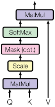

# Multi-Head-Attention-C-
Implementation of a Multi-Head Attention Layer in C++ from scratch

Implemented [scaled dot product attention](https://github.com/a3a256/Multi-Head-Attention-C-/blob/main/include/mha.h?plain=1#L83):

