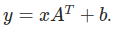

# Multi-Head-Attention-C-
Implementation of a Multi-Head Attention Layer in C++ from scratch

Multi Head attention was introduced in [Attention is All You Need](https://arxiv.org/abs/1706.03762) paper

Implemented [scaled dot product attention](https://github.com/a3a256/Multi-Head-Attention-C-/blob/main/include/mha.h?plain=1#L83):

</img>

And using the implementation of this attention head structure the following [Multihead Attention](https://github.com/a3a256/Multi-Head-Attention-C-/blob/main/include/mha.h?plain=1#L37) layer design was implemented:

</img>

Classic [Linear layer](https://github.com/a3a256/Multi-Head-Attention-C-/blob/main/include/mha.h?plain=1#L11) was implemented as well:

</img>

